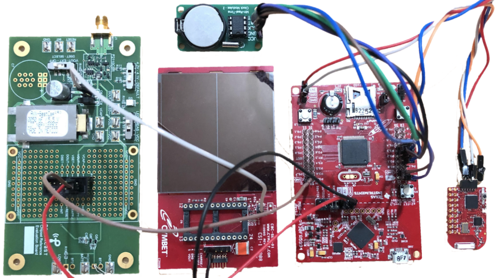

# About Ent-Lab
ENT-Lab aims to explore the cross-cutting research problems and gaps concerning the hardware and software for networked embedded systems with extreme resource and energy constraints. These systems will significantly impact how we live and work in the near future since there will be billions of interconnected devices. This situation will create a significant demand for more bandwidth, low-power operation, sustainability, confidentiality, security, dependability, and many more. ENT-Lab focuses on designing systems by considering these requirements and works on the problems at the intersection of embedded systems, computer architectures, energy harvesting, the internet of things,  low-power wireless protocols, sensor networks and distributed algorithms, operating systems/run-times, and machine learning. 

A more focused vision of ENT-Lab is to build and deploy networked embedded devices that can harvest ambient energy, run forever without batteries and support a wide-range range of green applications from remote sensing to wearables. To achieve this, ENT-Lab explores (i) ultra-low-power computation techniques and software building blocks, (ii) communication protocols, and (iii) architectural support for energy harvesting devices.

Our current research activities include:
- Software systems and programming support for intermittent computing
- Architectural (hardware) support for intermittent computing
- Batteryless and intermittent networking
- Tiny machine learning on the batteryless edge.

## Equipment
 ENT-Lab offers state-of-the-art microcontroller-based computing platforms,  field-programmable gate arrays (FPGAs), sensors, wireless modules, energy harvesting kits, and measurement tools to create testbeds for experimental evaluations and demonstrate real-world applications.
