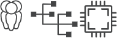

# Welcome to Embedded and Networked Things Group!

 ENT-Lab aims to explore the cross-cutting research problems and gaps concerning the hardware and software for networked embedded systems with extreme resource and energy constraints. Our current research activities include:
- Software systems and programming support for intermittent computing
- Architectural (hardware) support for intermittent computing
- Batteryless and intermittent networking
- Tiny machine learning on the batteryless edge.
